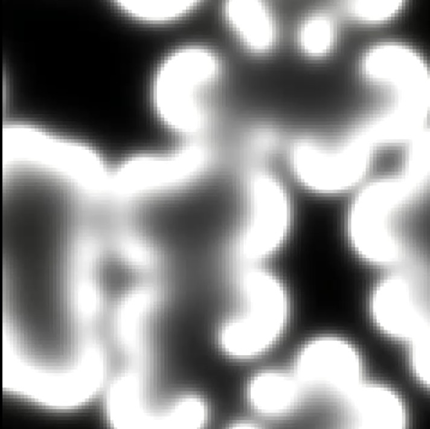
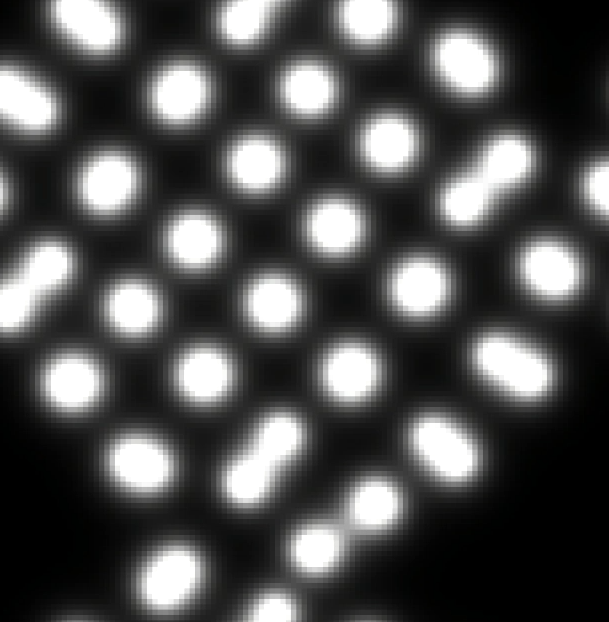
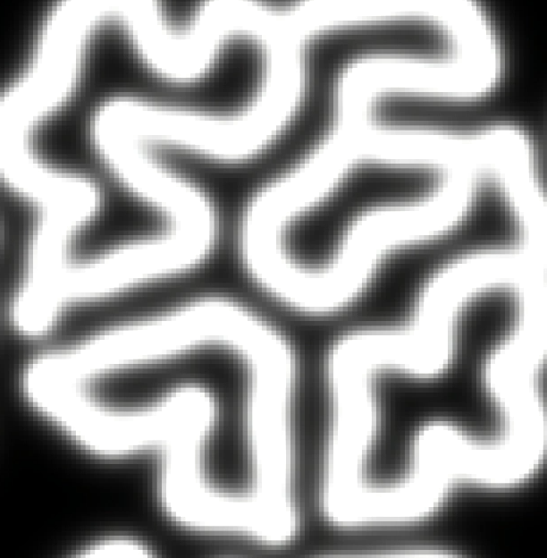

# Reaction Diffusion
This project is a simulation of the Reaction Diffusion Algorithm first put forward by Alan Turing. I have used the Gray-Scott model for my project. It implements the Gray–Scott model to generate emergent patterns such as spirals, stripes, and mitosis-like structures.

## Demo
<table> <tr> <td align="center"> <a href="images">   <em>Spiral Pattern</em> </a> </td> <td align="center"> <a href="images">   <em>Maze Pattern</em> </a> </td> </tr> <tr> <td align="center"> <a href="images">   <em>Mitosis Pattern</em> </a> </td> <td align="center"> <a href="images">   <em>Coral Growth Pattern</em> </a> </td> </tr> </table>
 
<h3>Sources </h3>
[Karl Sims Reaction-Diffusion Tutorial](https://www.karlsims.com/rd.html) 
[Coding Challenges by The Coding Train](https://www.youtube.com/watch?v=BV9ny785UNc&list=PLRqwX-V7Uu6ZiZxtDDRCi6uhfTH4FilpH&index=18&t=184s) 
[Simulations by Maciej Matyka](https://maciejmatyka.blogspot.com/2022/01/compute-shaders-in-open-frameworks.html)
